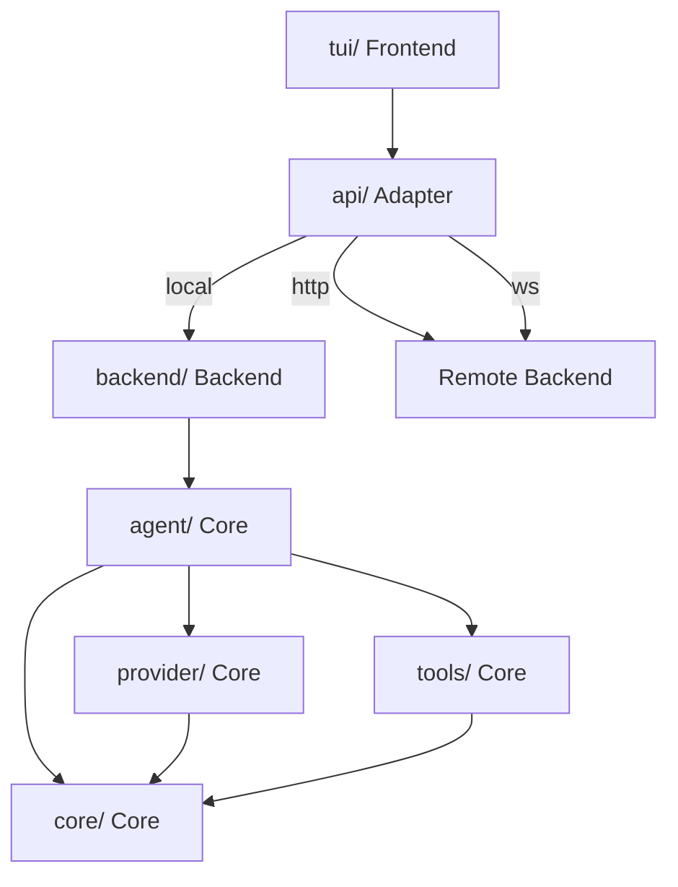
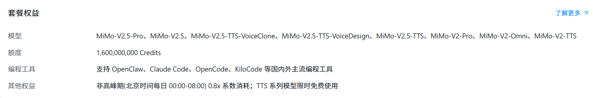
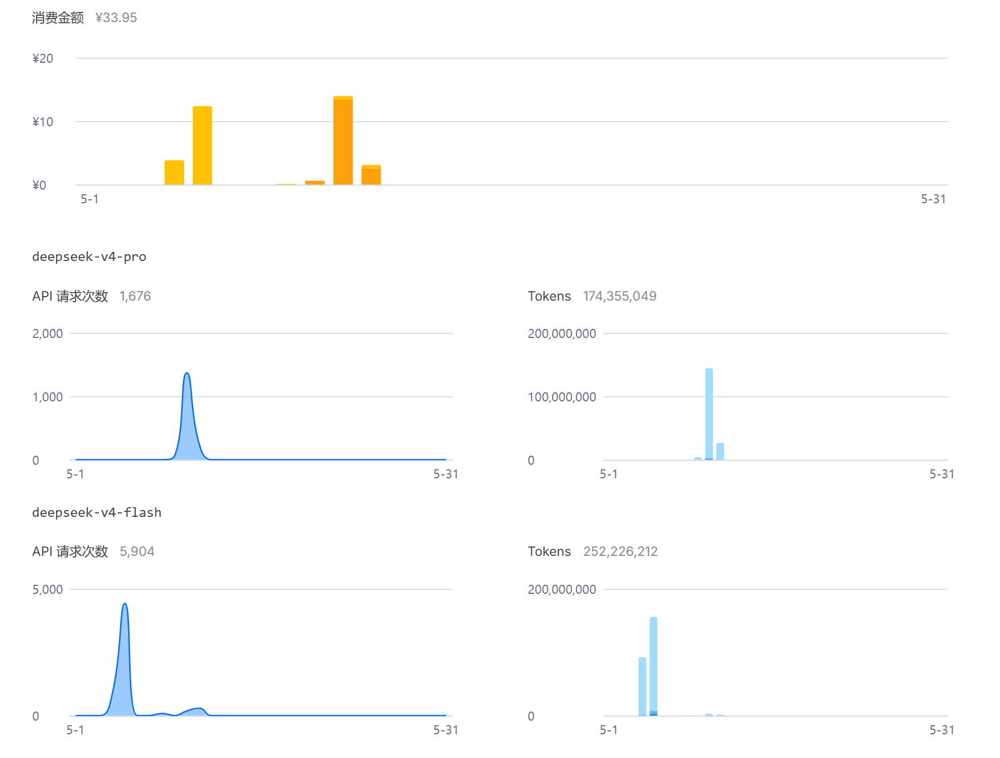

<div align="center">

# Maix-Agent

[](./COPYRIGHT)
[](./LICENSE)
[](./COMMERCIAL.md)

[[English]](./README.md)
[[简体中文]](./README_zh-CN.md)

</div>

A hybrid AI-Agent implementation with multiple AI architectures, powerful memory capabilities, and programmable features.

---

## Architecture

Backend and TUI are fully decoupled, communicating through an API adapter layer. Build scripts choose the coupling method:
- `tui-shell`: TUI connects to remote Backend via HTTP/WebSocket
- `backend-solo`: Backend runs independently, exposing API for any client
- `tui-with-backend`: TUI and Backend bundled together, local direct connection

```
src/
├── backend/                Backend core
│   ├── core/               Core Layer: type definitions, config loading, error hierarchy, logger, event bus
│   ├── provider/           Core Layer: LLM Provider abstraction & implementations (OpenAI / Anthropic), model routing
│   ├── agent/              Core Layer: Agent main loop, session management, memory store, context compaction, mode system, task queue, multi-agent collaboration
│   ├── tools/              Core Layer: tool system (file ops, commands, search, approval mechanism)
│   ├── mcp/                Core Layer: MCP protocol client
│   └── monitor/            Core Layer: WebSocket monitoring service
├── tui/                    Frontend TUI
│   ├── app.ts              TUI main application
│   ├── api/                API adapter layer
│   │   ├── types.ts        Frontend type definitions (BackendAPI interface)
│   │   ├── local.ts        Local direct connection adapter
│   │   ├── http.ts         HTTP API adapter
│   │   └── ws.ts           WebSocket adapter
│   ├── panels/             Status panels
│   ├── themes/             Theme management (dark/light)
│   └── utils/              Utilities (keybindings, Markdown rendering)

scripts/              Build scripts
├── bunbuild-*-windows_x64.mjs   Bun cross-compilation (Windows x64)
└── esbuild-*.mjs                esbuild bundling

build/                Bun compiled binaries
dist/                 esbuild bundled output
```



## Features

### Implemented
- Single-agent local tool operations (fs_read, fs_write, fs_edit, shell_exec, grep, glob)
- Human-like long-term memory system (Episodic / Semantic / Working)
- Multi-provider support: OpenAI / Anthropic with streaming
- Multi-session management with persistent storage
- Tool call approval mechanism (manual/auto-approve)
- Context window management with automatic compaction
- Theme switching (dark / light)
- Markdown terminal rendering
- Plan / Agent / YOLO three modes freely switchable
- Multi-model routing: auto-detect task category, select optimal LLM
- Dynamic task queue: priority, dependency, positional insertion
- Identity/persona system: natural language identity definition with persistent storage
- Skill system: maix-skill.toml + SKILL.md dual format
- MCP protocol: JSON-RPC 2.0 client
- Multi-agent collaboration (Hierarchical / Collaborative / Debate)
- Programmable topology: TOML DSL for execution flow definition
- Real-time agent work status monitoring (EventBus + WebSocket)
- TUI status panel: real-time display of agent status, task queue, token consumption

## Quick Start

```bash
# Clone repository
git clone https://github.com/JularDepick/Maix-Agent.git
cd Maix-Agent

# Install dependencies
pnpm install

# Configure environment
cp .env.example .env
# Edit .env to fill in your API Key

# Build
pnpm build
```

## Build

```bash
# Bun cross-compilation (generate Windows executable)
pnpm build

# esbuild bundling (output Node.js runnable ESM)
pnpm esbuild
```

Build output is in `build/` directory. For distribution, include the executable + `sql-wasm.wasm` + `.env`.

## Tech Stack

| Category | Technology |
|:---:|:---:|
| Runtime | Node.js |
| Language | TypeScript (strict mode, ESM) |
| Terminal UI | terminal-kit |
| Database | sql.js (SQLite WASM) |
| LLM SDK | openai, @anthropic-ai/sdk |
| Markdown Rendering | marked, highlight.js |
| WebSocket | ws |
| Package Manager | pnpm |
| Build Tool | Bun (cross-compilation), esbuild (bundling) |

## Project Structure

```
Maix-Agent/
├── src/                    # Source directory
│   ├── backend/            #   Backend core
│   │   ├── core/           #     Core types, config, errors, logger
│   │   ├── provider/       #     LLM Providers
│   │   ├── agent/          #     Agent core
│   │   ├── tools/          #     Tool system
│   │   ├── mcp/            #     MCP protocol
│   │   └── monitor/        #     Monitoring service
│   └── tui/                #   Frontend TUI
│       ├── app.ts          #     TUI main application
│       ├── api/            #     API adapter layer
│       ├── panels/         #     Status panels
│       ├── themes/         #     Theme management
│       └── utils/          #     Utilities
├── scripts/                # Build scripts
│   ├── bunbuild-*-windows_x64.mjs  # Bun cross-compilation (Windows x64)
│   └── esbuild-*.mjs               # esbuild bundling
├── build/                  # Bun compiled binaries
├── dist/                   # esbuild bundled output
├── package.json            # Project dependencies, scripts
├── tsconfig.json           # TypeScript configuration
├── .env.example            # Environment variables template
├── AGENTS.md               # Agent development guidelines
├── CONTRIBUTING.md         # Contributing guide
├── SECURITY.md             # Security policy
├── LICENSE                 # AGPL-3.0-or-later
├── COMMERCIAL.md           # Commercial licensing
└── COPYRIGHT               # Copyright notice
```

## Name Origin
`Maix` = `Max` + `Mix`, symbolizing "maximum memory capability" and "hybrid architecture".

## License
- **AGPL-3.0-or-later** for open-source use. See [[LICENSE]](./LICENSE)
- **Commercial closed-source licensing** available. See [[COMMERCIAL.md]](./COMMERCIAL.md)

## Links
- [[Report Bugs & Request Features]](https://github.com/JularDepick/Maix-Agent/issues)
- [[Apply for Commercial License]](./COMMERCIAL.md)

## Acknowledgements
- Thanks to the open-source community projects [[MiMoCode]](https://github.com/Hmbown/DeepSeek-TUI) and [[OpenHanako]](https://github.com/liliMozi/openhanako) for providing implementation ideas and reference standards for this project.
- Thanks to [[Xiaomi MiMo-V2.5 Open Source & Orbit 100T Token Program]]() for sponsoring this project with a total of **1600M credits** of LLM API service support
  
- Thanks to [[DeepSeek Open Platform]](https://platform.deepseek.com) for providing high-quality, cost-effective LLM API service support for this project
  
- Thanks to [[Claude Code]](https://code.claude.com) for providing AI Agent programming support for this project
