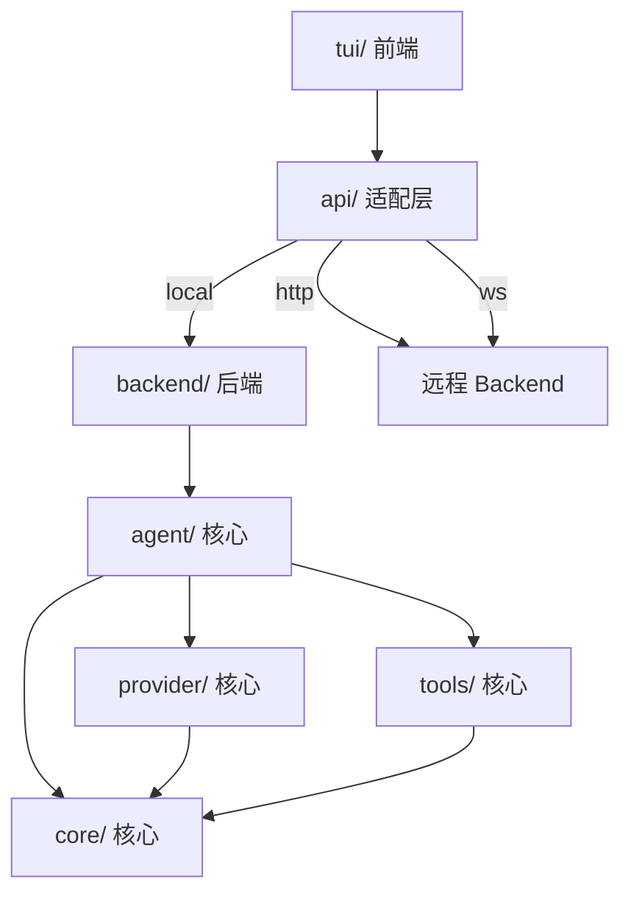

<div align="center">

# Maix-Agent

[](./COPYRIGHT)
[](./LICENSE)
[](./COMMERCIAL.md)

[[English]](./README.md)
[[简体中文]](./README_zh-CN.md)

</div>

一个混合了多种人工智能架构和组件的、具有强大记忆能力的、支持编程化的AI-Agent实现。

---

## 架构

Backend 与 TUI 完全解耦，通过 API 适配层通信。构建脚本选择耦合方式：
- `tui-shell`：TUI 通过 HTTP/WebSocket 连接远程 Backend
- `backend-solo`：Backend 独立运行，暴露 API 供任意客户端调用
- `tui-with-backend`：TUI 与 Backend 捆绑，本地直连

```
src/
├── backend/              后端核心
│   ├── core/             核心层：类型定义、配置加载、错误体系、日志、事件总线
│   ├── provider/         核心层：LLM Provider 抽象与实现（OpenAI / Anthropic）、模型路由
│   ├── agent/            核心层：Agent 主循环、会话管理、记忆存储、上下文压缩、模式系统、任务队列、多Agent协作
│   ├── tools/            核心层：工具系统（文件、命令、搜索、审批机制）
│   ├── mcp/              核心层：MCP 协议客户端
│   └── monitor/          核心层：WebSocket 监控服务
├── tui/                  前端 TUI
│   ├── app.ts            TUI 主应用
│   ├── api/              API 适配层
│   │   ├── types.ts      前端类型定义（BackendAPI 接口）
│   │   ├── local.ts      本地直连适配器
│   │   ├── http.ts       HTTP API 适配器
│   │   └── ws.ts         WebSocket 适配器
│   ├── panels/           状态面板
│   ├── themes/           主题管理（dark/light）
│   └── utils/            工具函数（快捷键、Markdown 渲染）

scripts/                构建脚本
├── bunbuild-*.mjs      Bun 交叉编译（Windows x64）
└── esbuild-*.mjs       esbuild 打包

build/                  Bun 编译产物
dist/                   esbuild 打包产物
```



## 功能支持

### 已实现
- 单Agent操作本地工具（fs_read、fs_write、fs_edit、shell_exec、grep、glob）
- 类人脑长期记忆系统（Episodic / Semantic / Working）
- 多Provider支持：OpenAI / Anthropic 流式对话
- 多会话管理与持久化存储
- 工具调用审批机制（手动/自动批准）
- 上下文窗口管理与自动压缩
- 主题切换（dark / light）
- Markdown 终端渲染
- Plan / Agent / YOLO 三种模式自由切换
- 多模型路由：自动检测任务类别，选择最佳LLM
- 动态任务队列：优先级、依赖、位置插入
- 身份人格系统：自然语言描述的身份设定，持久化存储
- 技能系统：maix-skill.toml + SKILL.md 双格式
- MCP协议：JSON-RPC 2.0 客户端
- 多Agent协作（Hierarchical / Collaborative / Debate）
- 可编程拓扑：TOML DSL 定义执行流程
- 实时Agent工作状态查看（EventBus + WebSocket）
- TUI状态面板：实时显示Agent状态、任务队列、Token消耗

## 快速开始

```bash
# 克隆仓库
git clone https://github.com/JularDepick/Maix-Agent.git
cd Maix-Agent

# 安装依赖
pnpm install

# 配置环境变量
cp .env.example .env
# 编辑 .env 填入 API Key

# 构建
pnpm build
```

## 构建

```bash
# Bun 交叉编译（生成 Windows 可执行文件）
pnpm build

# esbuild 打包（输出 Node.js 可运行的 ESM 产物）
pnpm esbuild
```

构建产物位于 `build/` 目录，分发时需携带可执行文件 + `sql-wasm.wasm` + `.env`。

## 技术栈

| 类别 | 技术 |
|:---:|:---:|
| 运行时 | Node.js |
| 语言 | TypeScript (strict mode, ESM) |
| 终端 UI | terminal-kit |
| 数据库 | sql.js (SQLite WASM) |
| LLM SDK | openai, @anthropic-ai/sdk |
| Markdown 渲染 | marked, highlight.js |
| WebSocket | ws |
| 包管理 | pnpm |
| 构建工具 | Bun (交叉编译), esbuild (打包) |

## 项目结构

```
Maix-Agent/
├── src/                    # 源码目录
│   ├── backend/            #   后端核心
│   │   ├── core/           #     核心类型、配置、错误、日志
│   │   ├── provider/       #     LLM Provider
│   │   ├── agent/          #     Agent 核心
│   │   ├── tools/          #     工具系统
│   │   ├── mcp/            #     MCP 协议
│   │   └── monitor/        #     监控服务
│   └── tui/                #   前端 TUI
│       ├── app.ts          #     TUI 主应用
│       ├── api/            #     API 适配层
│       ├── panels/         #     状态面板
│       ├── themes/         #     主题管理
│       └── utils/          #     工具函数
├── scripts/                # 构建脚本
│   ├── bunbuild-*-windows_x64.mjs  # Bun 交叉编译（Windows x64）
│   └── esbuild-*.mjs               # esbuild 打包
├── build/                  # Bun 编译产物
├── dist/                   # esbuild 打包产物
├── package.json            # 项目依赖、脚本命令
├── tsconfig.json           # TypeScript 编译配置
├── .env.example            # 环境变量模板
├── AGENTS.md               # Agent 开发守则
├── CONTRIBUTING.md         # 贡献指南
├── SECURITY.md             # 安全策略
├── LICENSE                 # AGPL-3.0-or-later
├── COMMERCIAL.md           # 商业授权
└── COPYRIGHT               # 版权声明
```

## 名称来源
`Maix` = `Max` + `Mix`，寓意「最大记忆能力」和「混合型架构」。

## 许可证
- **AGPL-3.0-or-later** 用于开源使用。详见 [[LICENSE]](./LICENSE)
- **商用闭源授权** 可用。详见 [[COMMERCIAL.md]](./COMMERCIAL.md)

## 链接
- [[报告漏洞和提出期望]](https://github.com/JularDepick/Maix-Agent/issues)
- [[申请商用闭源]](./COMMERCIAL.md)

## 致谢
- 感谢开源社区项目 [[MiMoCode]](https://github.com/XiaomiMiMo/MiMo-Code) [[OpenHanako]](https://github.com/liliMozi/openhanako) 为本项目提供实现思路和参考规范
- 感谢 [[小米MiMo-V2.5系列开源 & Orbit百万亿Token计划 & MiMoCode限时免费]](https://platform.xiaomimimo.com/) 为本项目提供超 **500M TOKEN** 的大模型API算力服务赞助支持
- 感谢 [[DeepSeek开放平台]](https://platform.deepseek.com) 为本项目提供低价高质的大模型API算力服务支持
- 感谢 [[Claude Code]](https://code.claude.com) [[MiMoCode]](https://github.com/XiaomiMiMo/MiMo-Code) 为本项目提供 AI Agent 编程支持
